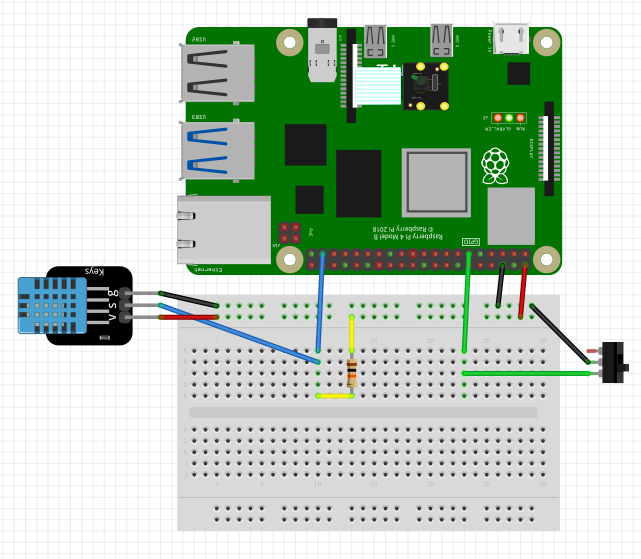
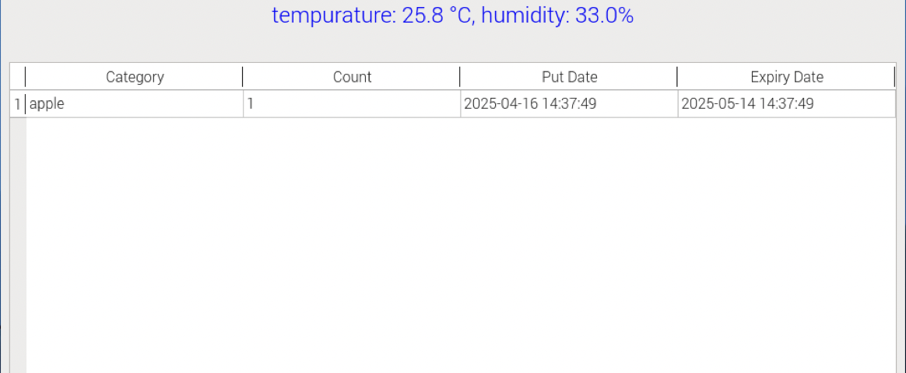

#  **Fruit and vegetable visual recognition system based on Raspberry Pi** 

## Project Overview
This is an intelligent refrigerator system that identifies food types and freshness through visual recognition, and records food storage time to optimize storage and reduce food waste.


---

## 📌 INTRODUCTION
### **-Background** 
In our daily life,improper storage and forgotten food often cause uncertainty about consumption order, leading to spoilage and waste.So we came up with the idea of designing a smart refrigerator system to optimize storage and reduce food waste.

### **- Device**

<table align="center">
  <tr>
    <td align="center">
      <br>
      <strong>Raspberry Pi 5</strong>
    </td>
    <td align="center">
      <br>
      <strong>External Raspberry Camera</strong>
    </td>
  </tr>
  <tr>
    <td align="center">
      <br>
      <strong>Switch (KW11-B, 20×10×6.5mm)</strong>
    </td>
    <td align="center">
      <br>
      <strong>Temperature and Humidity Sensor (DHT11)</strong>
    </td>
  </tr>
</table>


## Hardware Connection Diagram

<p align="center">
  <br>
</p>


---

## 🔥 **Main function**

### ✅ **Automatic identification of stored ingredients**  
When the **refrigerator door opens**, the camera automatically activates to detect both existing and newly added food.

### ✅ **Intelligent storage management**  
When the **refrigerator door closes**, the system records the recognition results, **calculates shelf life**, displays food status in real time, and alerts users to expiring items.

### ✅ **Temperature and humidity monitoring**  
The refrigerator continuously monitors **temperature and humidity** to ensure optimal operating conditions.

---

## 🧩 Environment Setup

### 🛠️ Requirements

- Qt 5  
- OpenCV  
- Ultralytics YOLOv5  
- libgpio 
- cmake

---

### 1.  Install Python Packages (for YOLOv5)

 ```bash 
pip install ultralytics opencv-python PyQt5 
 ```

### 2.  Install Ultralytics YOLOv5 (optional from source)

```bash 
git clone https://github.com/ultralytics/ultralytics.git
cd ultralytics
pip install -e . 
```

### 3. Install OpenCV (C++ version)

```bash 
sudo apt update
sudo apt install libopencv-dev 
``` 

### 4. Install Qt 5

```bash 
sudo apt update
sudo apt install qt5-default qtcreator -y 
``` 

### 5. Install libgpio

 ```bash 
sudo apt update
sudo apt install libgpiod-dev gpiod 
```

### 6. Install CMake

 ```bash 
sudo apt update
sudo apt install cmake 
```
---
## 🧩 Build & Run

### Build：

 ```bash 
mkdir build
cp best.onnx build/
cd build
cmake ..
make
```
### Run：

 ```bash 
./fridgemanager
```
## 🧩 Display

### When the fruit appears under the camera, the detection results will be displayed in real time.

<p align="center">
  <br>
  <strong>Detection Result</strong>
</p>

### When the switch is pressed (that is, when the refrigerator door is closed), the second interface will be displayed, showing the type of fruit identified, the date it was placed in the refrigerator, and the expiration date.

<p align="center">
  <br>
  <strong>Detection Result2</strong>
</p>

---

## 🧩 Social Media

<p align="center">
  
</p>

<p align="center">
  🎥 <strong>Watch our full project journey on TikTok:</strong><br>
  <a href="https://www.tiktok.com/@glasgow_rtep_team09?is_from_webapp=1&sender_device=pc">
    https://www.tiktok.com/@glasgow_rtep_team09
  </a>
</p>

---

## 🧩 Authors

| Member         | Contribution                                   |
|----------------|------------------------------------------------|
| Chen Wei       | Open cv,yolo and Project Integratio     |
| Hanxi Lu       | Open cv,yolo and Project Integratio     |
| Shule Chong    | Cmakelists and README part                     |
| Zhongyuan Peng | Sensor and Social media part                   |
| Zheyu Gao      | Camera and Qt part                                        |


---

## 🧊 Minimum Shelf Life of Fruits and Vegetables in Refrigerator (~4°C)

| Item                  | Min. Shelf Life (days) | Recommended for Refrigeration | Reference |
|-----------------------|------------------------|-------------------------------|-----------|
| Apple                 | 28                     | ✅ Yes                         | [1]       |
| Cabbage               | 28                     | ✅ Yes                         | [2]       |
| Carrot                | 28                     | ✅ Yes                         | [3]       |
| Grape                 | 7                      | ✅ Yes                         | [4]       |
| Lemon                 | 28                     | ✅ Yes                         | [5]       |
| Mango (ripe only)     | 5                      | ⚠️ Yes (only after ripening)  | [6]       |
| Napa cabbage          | 56                     | ✅ Yes                         | [7]       |
| Peach (ripe only)     | 3                      | ✅ Yes (only after ripening)  | [8]       |
| Bell/Chili Pepper     | 14                     | ✅ Yes                         | [9]       |
| Radish                | 21                     | ✅ Yes                         | [10]      |

## 📚 References

1. [UC Davis – Apple Storage Guidelines](http://postharvest.ucdavis.edu/Commodity_Resources/Fact_Sheets/)  
2. [USDA Handbook 66 – Cabbage](https://ucanr.edu/datastoreFiles/234-1507.pdf)  
3. [FAO Agricultural Services Bulletin – Carrot](http://www.fao.org/3/y5431e/y5431e05.htm)  
4. [UC Davis Postharvest Guidelines – Grapes](http://postharvest.ucdavis.edu)  
5. [UF IFAS Extension – Citrus Storage](https://edis.ifas.ufl.edu/pdf/HS/HS132300.pdf)  
6. [FAO – Mango Maturity and Ripening](http://www.fao.org/3/y4358e/y4358e05.htm)  
7. [Postharvest Biology of Chinese Cabbage (2019)](https://doi.org/10.1007/s13197-019-03747-x)  
8. [UC Davis – Peach Postharvest Handling](http://postharvest.ucdavis.edu)  
9. [FAO – Storage of Fresh Peppers](http://www.fao.org/3/y4358e/y4358e07.htm)  
10. [UC Davis – Radish Storage Fact Sheet](http://postharvest.ucdavis.edu/Commodity_Resources/Fact_Sheets/)


