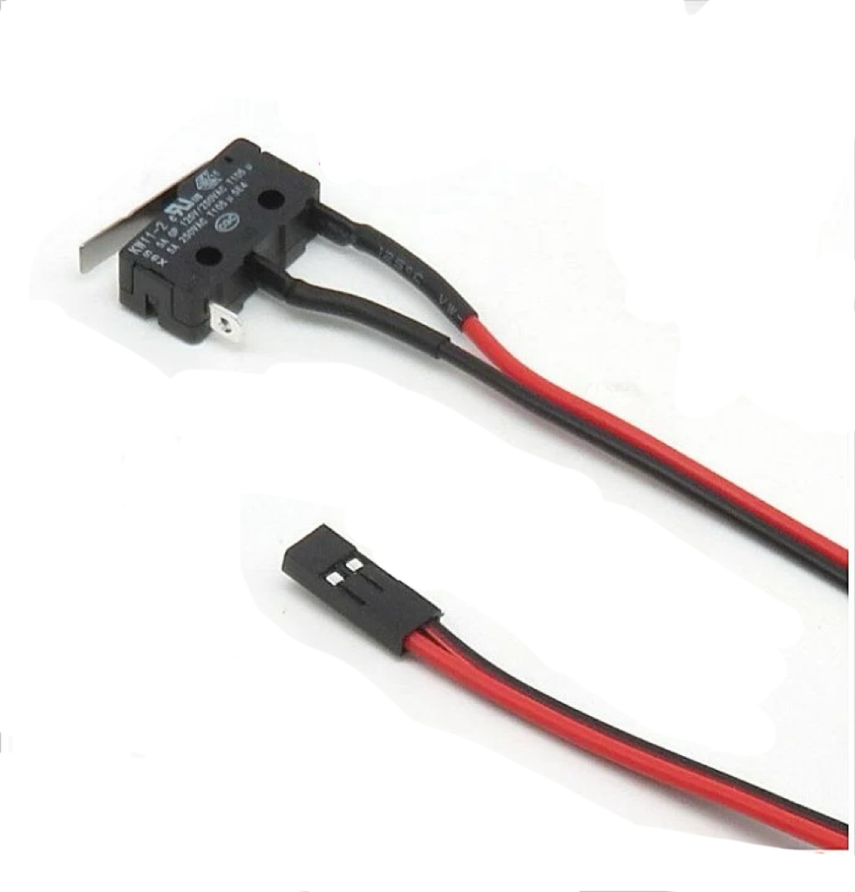

#  **Fruit and vegetable visual recognition system based on Raspberry Pi** 

## Project Overview
This is an intelligent refrigerator system that identifies food types and freshness through visual recognition, and records food storage time to optimize storage and reduce food waste.


---

## 📌 INTRODUCTION
### **-Background** 
In our daily life,improper storage and forgotten food often cause uncertainty about consumption order, leading to spoilage and waste.So we came up with the idea of designing a smart refrigerator system to optimize storage and reduce food waste.

### **- Device**

<p align="center">
  <br>
  <strong>Raspberry Pi 5</strong>
</p>

<p align="center">
  <br>
  <strong>External Raspberry Camera</strong>
</p>

<p align="center">
  <br>
  <strong>Switch (KW11-B, 20×10×6.5mm)</strong>
</p>

<p align="center">
  <br>
  <strong>Temperature and Humidity Sensor(DHT11)</strong>
</p>

---

## 🔥 **Main function**

### ✅ **Automatic identification of stored ingredients**  
When the **refrigerator door opens**, the camera automatically activates to detect both existing and newly added food.

### ✅ **Intelligent storage management**  
When the **refrigerator door closes**, the system records the recognition results, **calculates shelf life**, displays food status in real time, and alerts users to expiring items.

### ✅ **Temperature and humidity monitoring**  
The refrigerator continuously monitors **temperature and humidity** to ensure optimal operating conditions.

---

## 🧩 Environment Setup

### 🛠️ Requirements

- Qt 5  
- OpenCV  
- Ultralytics YOLOv5  
- libgpio 
- cmake

---

### 1.  Install Python Packages (for YOLOv5)

 ```bash 
pip install ultralytics opencv-python PyQt5 
 ```

### 2.  Install Ultralytics YOLOv5 (optional from source)

```bash 
git clone https://github.com/ultralytics/ultralytics.git
cd ultralytics
pip install -e . 
```

### 3. Install OpenCV (C++ version)

```bash 
sudo apt update
sudo apt install libopencv-dev 
``` 

### 4. Install Qt 5

```bash 
sudo apt update
sudo apt install qt5-default qtcreator -y 
``` 

### 5. Install libgpio

 ```bash 
sudo apt update
sudo apt install libgpiod-dev gpiod 
```

### 6. Install CMake

 ```bash 
sudo apt update
sudo apt install cmake 
```
---
## 🧩 Build & Run

### Build：

 ```bash 
mkdir build
cd build
cmake ..
make
```
### Run：

 ```bash 
./fridgemanager
```
## 🧩 Display


